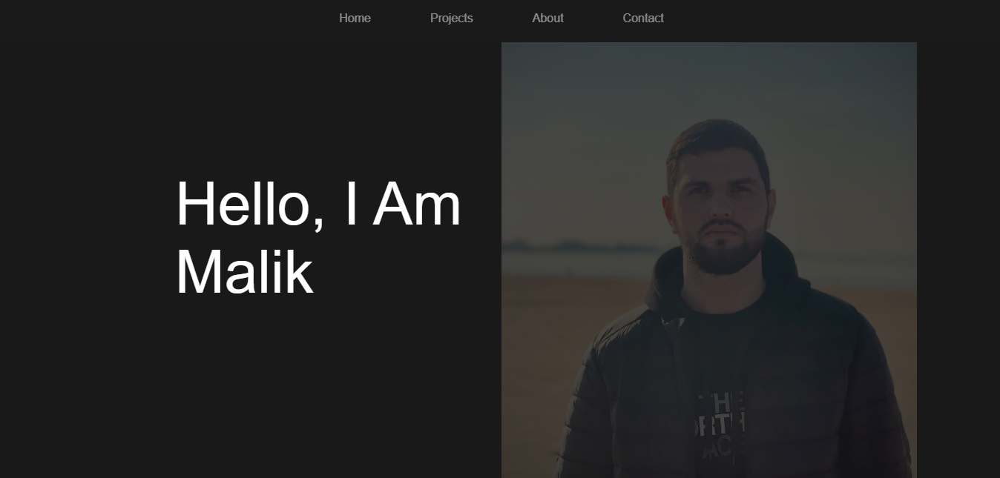

# Portfolio

> A portfolio site to shows my best work and professional skills in web
> development.

## Table of contents

- [Portfolio](#portfolio)
  - [Table of contents](#table-of-contents)
  - [General info](#general-info)
  - [Screenshots](#screenshots)
  - [Technologies](#technologies)
  - [Setup](#setup)
  - [Code Examples](#code-examples)
  - [Status](#status)

## General info

> My portfolio has collected in one place the main information about me and the
> projects that I have done.

## Screenshots



## Technologies

- Node 14.16.0
- VSC code
- HTML
- CSS
- JavaScript

## Setup

- create a new repo form the template `template-html-css`
- turn on GitHub pages
- protect `main` branch

## Code Examples

```js
// js code for navigation bar
links.forEach((link, i) => {
  link.addEventListener("click", () => {
    if (activeLink != i) {
      links[activeLink].classList.remove("active");
      link.classList.add("active");
      sections[activeLink].classList.remove("active");
```

## Status

Project is: _done_
